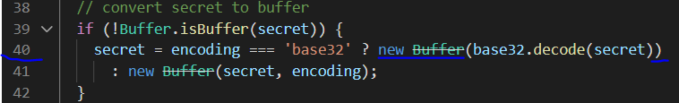
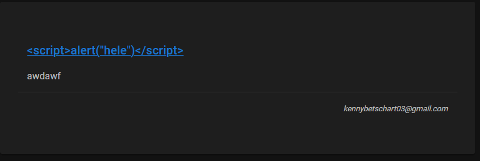
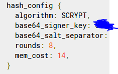

# modul183

## Startup

Im "modul183" Ordner befinder sich unser Blog Projekt mit Nuxt.
Bevor das Projekt gestartet werden kann, muss der command "yarn" im Pfad "/modul183" ausgeführt werden. \
Falls ein "yarn" ausgeführt wurde, muss eine Datei des "speakeasy" Packages angepasst werden, da bei dem package teilweise ein Fehler auftreten kann der in der "modul183/libraries.md" Datei beschrieben ist. Es söllte möglich sein die changes auf Zeile 40 in der Datei "node_modules/speakeasy/index.js" über git zurückzusetzen, falls das nicht funktioniert muss die Zeile so abgeändert werden:

Um das project zu starten kann nachher der command "yarn dev" im Pfad "/modul183" ausgeführt werden und die app auf "http://localhost:3000" angesehen werden
Um die SmsAuth zu benutzen können muss der Api Key angepasst werden in der /components/SmsAuth.vue Datei

## Logging

Unser Konzept für das Logging von unserem Projekt würde auf den Firebase Cloud Functions basieren. Nähmlich bietet firebase die Möglichkeit von ihnen bereit gestellten logggin Funktionen zu zu greifen. Dies Funktionen besitzen bereits die Möglichkeit mit Log Level Log zu schreiben und die Sicherheit würde auch von ihnen gehandhabt werden. Dies bietet extrem entlastung für uns, da somit wir uns nicht so tief damit befassen müssen und auch nicht dafür zu ständigen wären die Lösung auf dem aktuellen Sicherheitstand zu halten. Leider sind Firebase Cloud Functions kostenpflichtig und wir haben uns daher dagegen entschieden dies noch wegen dem Kostenfaktor praktisch umzusetzen.
Mehr Informationen kann auf "https://firebase.google.com/docs/functions/writing-and-viewing-logs" gefunden werden.

## XSS

In unserer Applikation kann weder über die URL (Reflected XSS) noch über vom server geladenen Inhalten (stored xss) javascript code ausgeführt werden.
Über die URL können keine Scripts ausgeführt werden, da wir auf keiner Seite parameter von der URL holen.
Für das stored XSS haben wir versucht einen Post zu erstellen bei dem der Titel ein script enthält mit der alert() funktion.

Das script wird aber nie ausgeführt. Wir konnte in keiner Dokumentation von Vuetify oder NuxtJs etwas über XSS finden, der Ersteller von Vue sagte dass er nichts gegen XSS eingebaut hat, also vermuten wir, dass es von NuxtJs gelöst wird.
Ausserdem wird in eine Github Issue davon abgeraten das X-XSS-Protection Flag aktiv zu haben. Siehe hier "https://github.com/helmetjs/helmet/issues/230".

## Passwörter

Da wir die Firebase authentication nutzen werden die Passwörter auf firebase gespeichert. Passwörter werden zuerst mit einer von ihnen angepassten Version von "scrypt" gehasht. Weitere Parameter für das hashing sind hier: \
 \

# api

Im api Ordner befindet sich eine express app welche eine Api für die posts zur verfügung stellt.
Damit die api Zugriff auf die firebase datenbank mit den Posts hat, muss im Pfad "/api" ein firebase admin json file eingefügt werden.
Um den server zu starten muss zu erst dieser Command im "/api" Pfad ausgeführt werden: "yarn".
Der server kann dann mit "yarn start" gestartet werden.

Alle öffentlichen Posts können auf "http://localhost:8080/api/posts" angesehen werden oder auf "http://localhost:3000/api/posts" falls das Projekt im M183 Ordner läuft.
